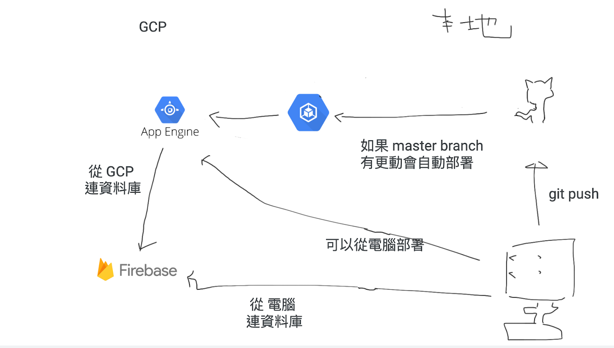
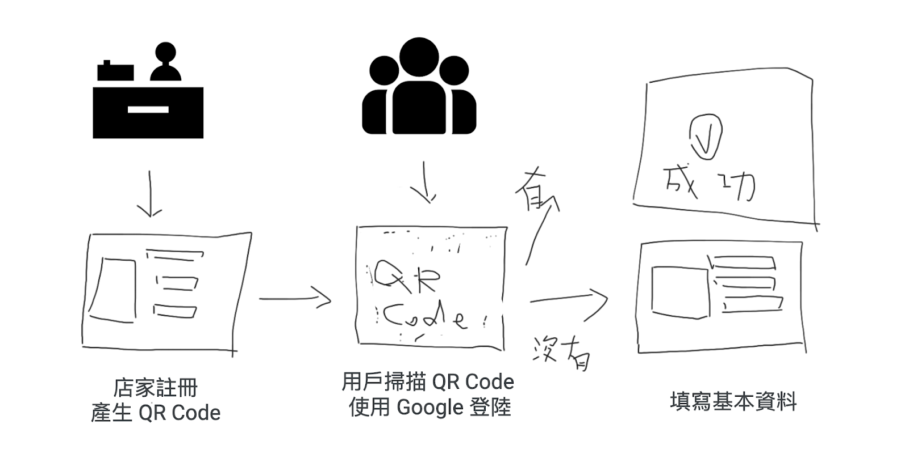

# 快速實聯制
因應政府在疫情實行的實聯制政策，進出各大公共場所時需要填寫實聯制表單，確保確診後可以透過實聯制的資料找到接觸者。本專案透過綁定社群帳號與實聯制所需資料，解決每次進入店家時都要花時間在填寫資料上的問題。
## Demo
[Demo (Host on Google Cloud Platform)](https://gcp2021test.uc.r.appspot.com/)
## 流程圖
### 系統架構圖

### 程式流程圖

## TODO
- 表單資料驗證
- 社群網站登錄串接
- 產生商家 QR Code
## 其他資訊
快速實聯制是五位高中生於 2021 北區 DSC 聯合黑客松開發的作品。
- [@AlecWu-127](https://www.github.com/AlecWu-127)
- [@Tr00y2ooo](https://www.github.com/Impossibleimagine)
- [@Suifung0214](https://www.github.com/Suifeng0214)
- [@terhead8775](https://www.github.com/terhead8775)
- [@liaojason2](https://www.github.com/liaojason2)